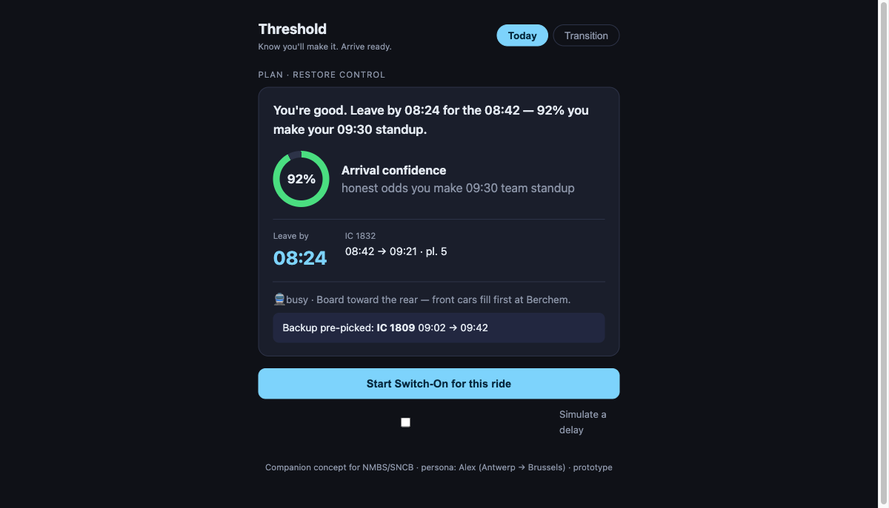
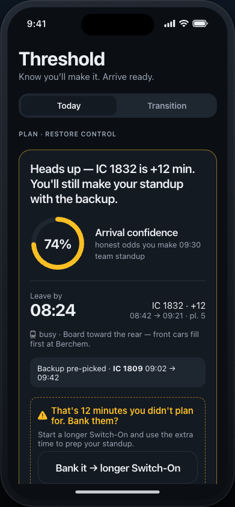
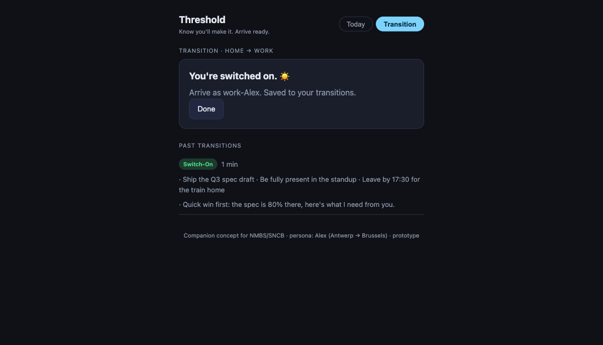

# Threshold — a commute companion (prototype)

**Threshold** turns an irregular train commute into something you *control* and arrive *ready* from.
It's the prototype from a UX project ("The Commuting Experience") built around **Alex**, a 37-year-old
hybrid worker who commutes Antwerp → Brussels a few times a week. Two linked modes:

- **Plan** — honest *arrival confidence* ("92% you make your 09:30 standup"), a pre-picked backup train,
  and a crowd hint → restores **perceived control** (the strongest evidence-backed lever for commute stress).
- **Transition** — a journey-length-matched **Switch-On** (morning: set 3 intentions → rehearse → focus) or
  **Switch-Off** (evening: close loops → park tomorrow → decompress) → restores the **home↔work boundary**.
- When a delay hits, it offers to **bank the lost time** into a longer transition instead of into stress.

Positioned as a companion to the NMBS/SNCB app. Built on a minimal React + Express + Sequelize stack that
runs locally with zero setup and deploys as a single Docker container on a self-hosted Coolify server.
*Tagline: "Know you'll make it. Arrive ready."*

> **Project docs:** the assignment, the research, and the full UX deliverables (persona, insights,
> "How might we", Crazy-8, converged concept, 3-min video script) live in [docs/](docs/) —
> see [docs/03-ux-deliverables.md](docs/03-ux-deliverables.md).

## Stack

- **Frontend:** React 18 + Vite 5 (JavaScript)
- **Backend:** Node.js + Express (ES modules)
- **Database:** Sequelize ORM — SQLite for local dev, PostgreSQL in production (picked automatically from `DATABASE_URL`)
- **Deploy:** Self-hosted on Coolify (Hetzner) — single Docker container, auto-deploy on push to `main`

## Project structure

```
.
├── backend/
│   ├── package.json
│   ├── server.js          # API: /api/today, /api/sessions, /api/health
│   ├── db.js              # Sequelize: SQLite locally, Postgres in production
│   └── models.js          # TransitionSession model
├── frontend/
│   ├── package.json
│   ├── vite.config.js
│   ├── index.html
│   └── src/
│       ├── main.jsx
│       ├── App.jsx            # tab shell (Today / Transition)
│       ├── TodayScreen.jsx    # Plan: arrival confidence + backup + delay reframe
│       ├── TransitionScreen.jsx  # Switch-On/Off timer, intentions, history
│       └── styles.css
├── docs/                  # UX project: brief, research, deliverables, screenshots
├── Dockerfile
├── .env.example
├── .gitignore
├── .dockerignore
└── README.md
```

## Local development

No database to install — SQLite is built in.

**Terminal 1 — backend:**

```bash
cd backend
npm install
npm run dev
```

**Terminal 2 — frontend:**

```bash
cd frontend
npm install
npm run dev
```

Open [http://localhost:5173](http://localhost:5173). The frontend proxies `/api` requests to the backend on
port 3001. Try the **Simulate a delay** toggle on the Today screen to see the disruption-reframe, and pick
**Demo · 20s** on the Transition screen to watch a full session in 20 seconds.

## Deploy

Self-hosted as a single Docker container on **Coolify** (Hetzner VPS), live at
**[commute-app.ontwrpn.com](https://commute-app.ontwrpn.com)**. Coolify builds the `Dockerfile` and
auto-deploys on every push to `main`. Set `DATABASE_URL` (Coolify-internal Postgres) in the app's
environment variables; left blank, the app runs on SQLite.

## Endpoints

| Method | Path | Description |
|--------|------|-------------|
| GET | `/api/today` | The day's Antwerp→Brussels plan (leave-by, arrival confidence, crowd, backup). `?disrupt=1` returns a delayed plan + reframe offer. |
| GET | `/api/sessions` | Most recent transition sessions (20). |
| POST | `/api/sessions` | Save a transition `{ type: "switch_on"\|"switch_off", durationMin, intentions[], note }`. |
| GET | `/api/health` | DB health check → `{ status: "ok", db: "sqlite" \| "postgres" }`. |
| GET | `*` | Serves the built React app (production only). |

## Screenshots

| Plan (on time) | Plan (delay + reframe) | Transition saved |
|---|---|---|
|  |  |  |
